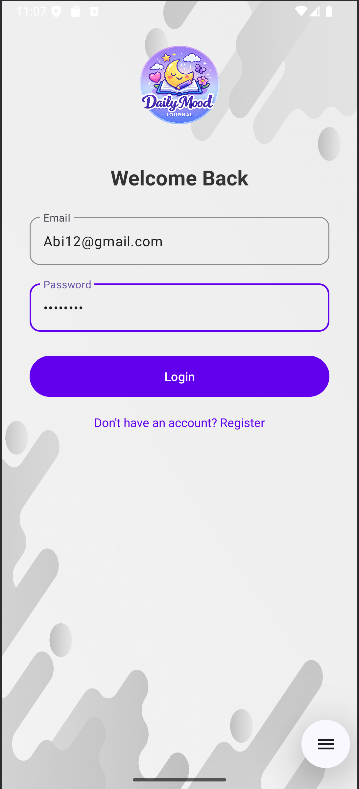
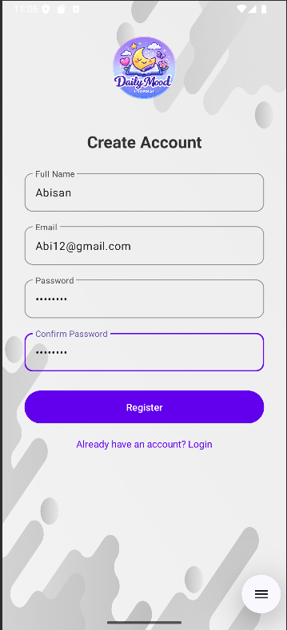
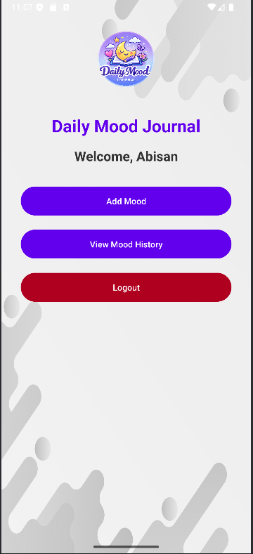
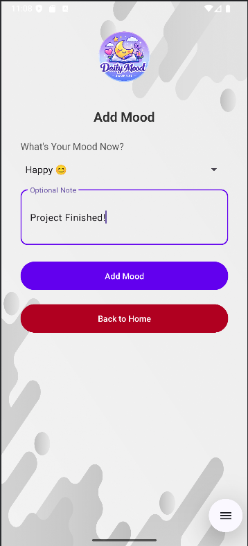
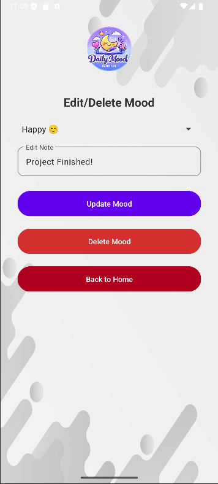
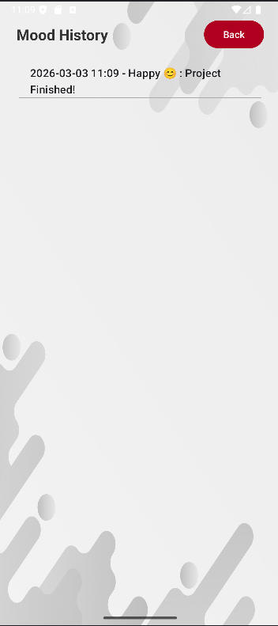

# 📔 Daily Mood Journal

*ICT3214 – Mobile Application Development Group Project*

The Daily Mood Journal is an Android application developed as part of the ICT3214 module. This application supports emotional self-reflection by allowing users to securely record their daily moods and optional notes. The system implements secure authentication, proper session handling, SQLite database integration, and user-based data filtering according to the project guidelines.

## 📌 Project Overview

This application was developed to demonstrate:
* Android application development using Java
* SQLite database integration
* Secure login and registration mechanisms
* Proper user session handling
* Full CRUD operations
* Version control using GitHub

The main goal of the app is to help users monitor their emotional patterns over time in a secure and private manner.

## ✨ Features

### 🔐 Authentication
* User Registration
* User Login
* Secure Logout
* Passwords are encrypted (not stored in plain text)
* Session-based user management

### 😊 Mood Logging
* Select mood (Happy, Neutral, Sad, etc.)
* Add optional short reflection note
* Automatic date recording
* View mood history organized by date
* Edit existing entries
* Delete mood entries

### 🛡 Data Privacy & Validation
* Logged-in users can only view their own data
* Proper foreign key relationship between Users and Mood Entries
* Basic input validation to prevent empty or invalid entries

## 🧩 Technologies Used

* *Platform:* Android
* *Programming Language:* Java
* *Database:* SQLite
* *IDE:* Android Studio
* *Version Control:* GitHub

## 📱 Screenshots

*Login Screen* 

*Registration Screen* 

*Dashboard Screen* 

*Add Mood Screen* 

*Edit/Delete Mood Screen* 

*Mood History Screen* 

## 🚀 Installation Guide

1. Clone the repository:
   git clone https://github.com/Abishuuu/Daily-Mood-Journal.git
2. Open the project in Android Studio
3. Sync Gradle
4. Run the app on:
   * Android Emulator
   * Physical Android Device

## 👥 Team Members

* *H.C.L. Perera* – ICT/2022/001
* *I.O. Subasinghe* – ICT/2022/002
* *S. Abisan* – ICT/2022/004
